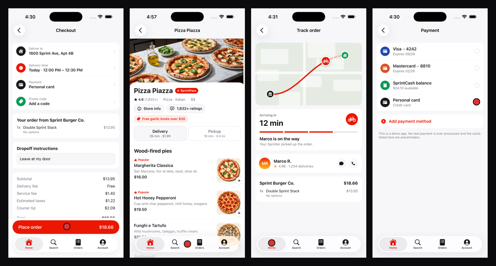

# Atlas review lenses

Four review lenses for agents that leave comments on your app's real screens.

Your app already has screenshots of every screen a run has touched. These are
the instruction sets that decide what an agent looks for in them, and each
finding gets pinned to the exact pixel it is about.



## Why lenses

One agent told to "review this app" returns a shallow mix of whatever it
noticed first. Four agents, each told to look for one thing and explicitly told
what to ignore, return four different classes of bug.

On the example app below, the four lenses found six issues and did not overlap
once. The ignore list in each lens is doing that work.

| Lens | Owns | Sample finding |
|---|---|---|
| [design](lenses/design.md) | visual correctness of what is rendered | the order total clipped in half by the Place order button |
| [usability](lenses/usability.md) | whether the screen tells the truth about state | Home lit in the nav while two screens deep in Account |
| [accessibility](lenses/accessibility.md) | measurable barriers, computed not estimated | price summary labels at 4.3:1 against a 4.5:1 AA floor |
| [pricing clarity](lenses/pricing-clarity.md) | what the user pays and what they pay with | the selected card showing no last four and no expiry |

## Quickstart

Requires the [Revyl CLI](https://docs.revyl.ai) and an app with a populated
Atlas.

```bash
revyl atlas apps
revyl skill install --name revyl-cli-atlas-review --force
```

Then point an agent at a lens:

> Review the checkout screen of DoorSprint using lenses/accessibility.md and
> leave a comment for each finding.

Or run one by hand. The command is the same for every lens, and only the
instruction changes:

```bash
revyl atlas annotations create --app "$APP" --observation "$OBS" \
  --target "the red Place order button showing 18.66 at the bottom" \
  --body "The Total row is clipped by this button. The scroll container needs bottom padding equal to the CTA height plus the safe-area inset."
```

Preview first when the target is ambiguous. A failed grounding creates nothing,
which is the point:

```bash
revyl atlas annotations create --app "$APP" --observation "$OBS" \
  --target "the trailing icon in the Password row" \
  --dry-run --preview-out /tmp/pin.png --json
```

## Rules that make the output usable

**Open the images.** A URL is not a review. If you did not look at the pixels
you do not have a finding.

**Measure anything measurable.** Contrast ratios get computed, not eyeballed:

```bash
python3 scripts/contrast.py screen.png --box 50,648,200,668
# contrast   4.33:1
# AA  (4.5:1)  FAIL
```

One suspicion in the example run (misaligned cards on the home feed) died on
measurement: the left edges were 47 to 49px, so it never became a comment.

**Target what is visible.** Occluded text cannot be grounded. Pin the element
causing the problem and describe the damage in the body.

**Cluster by root cause.** Six findings that are three bugs should be reported
as three bugs with six pins.

## Writing your own lens

A lens is four sections: what to look for, what to ignore, how to rank
severity, and how to phrase the target. The ignore list is what keeps two
lenses from returning the same bug. Copy any file in `lenses/` and change those
four sections.

Obvious ones this repo does not ship yet: copy and tone, empty and error
states, localization and text expansion, dark mode, first-run experience.

## Example run

[examples/doorsprint-findings.md](examples/doorsprint-findings.md) has the full
pass over a delivery app, with the screenshots, the pins, the measured contrast
numbers, and the one target the grounder refused.

## License

MIT
