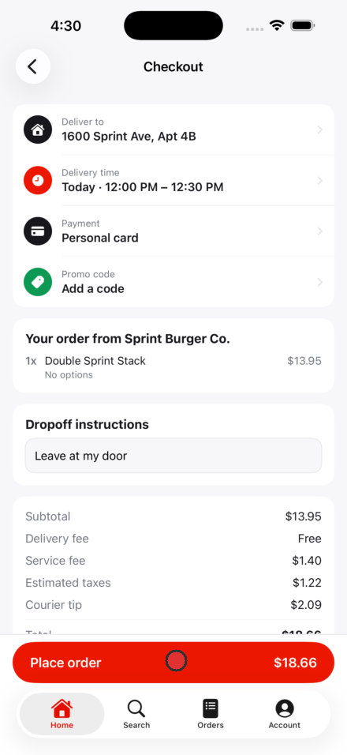
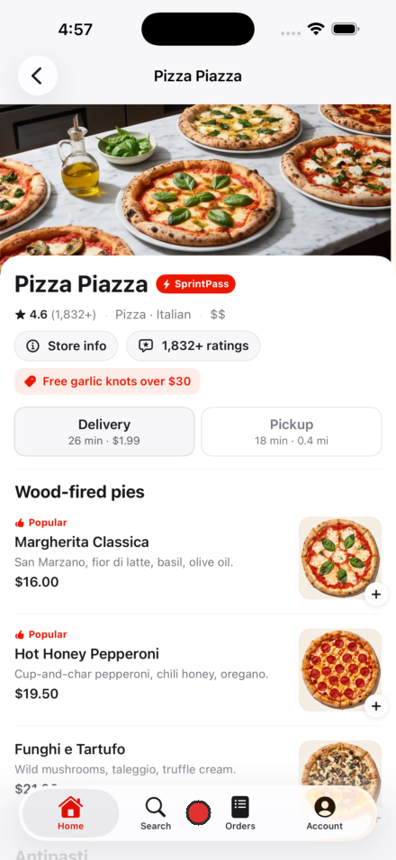
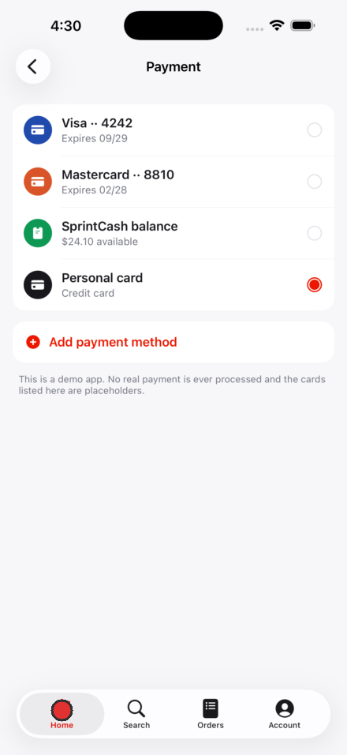
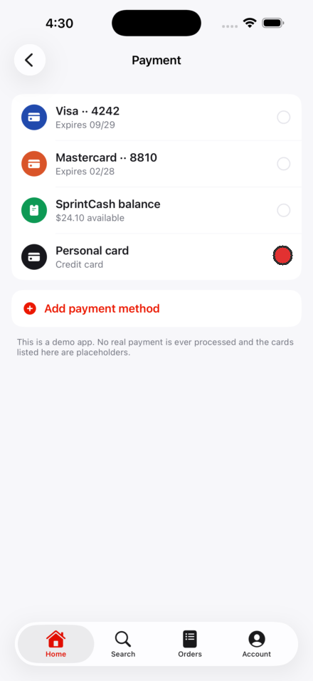

# Example run: DoorSprint

A real pass over a food delivery demo app with 34 screens in its Atlas. Four
lenses, six findings, three root causes. Every finding below was pinned by the
CLI with `agent_kind=claude_code` and `origin_surface=revyl_cli`.

The point of the example is not the bug count. It is that four narrow lenses
returned six findings with zero overlap, which is what a single "review this
app" prompt does not do.

## Design

**Checkout: the order total is clipped by the Place order bar.**
Subtotal, delivery fee, service fee, taxes, and tip all read cleanly, then the
Total row is cut in half by the floating CTA. The one number the user is
agreeing to is the one number they cannot read.



**Merchant menu: the last row's price is behind the tab bar.**
The Funghi e Tartufo price and the Antipasti section header below it are
covered by the floating tab bar, and the list cannot scroll past it.



Both are the same root cause: floating bottom chrome drawn over scrollable
content with no matching bottom inset. Fix it once at the scroll container.

## Usability

**The tab bar does not follow the pushed route.**
Home stays highlighted on Track order, which is reached from Orders, and again
inside Account then Payment. Two screens, one bug.



## Accessibility

**Price summary labels fail AA.**
Sampling the glyph pixels off the Atlas screenshot and computing the WCAG ratio
gives about 4.27:1 for Subtotal and 4.33:1 for Delivery fee against white. The
AA floor for normal text is 4.5:1. The values in the right column are near
black at roughly 14.5:1 and pass comfortably.

So every row explaining what the user pays is the faintest text on the screen,
while the amounts themselves are the darkest. Measured on a 440x956 render, so
it sits within a hair of the line either way, which is still worth a comment.

## Pricing clarity

**The selected card is the only one with no identifying detail.**
Visa shows last four and expiry. Mastercard shows last four and expiry.
SprintCash shows a balance. The selected "Personal card" says only
"Credit card", so the user cannot confirm what they are about to be charged on.



## What the grounder refused

The first attempt targeted the clipped Total directly:

```
Error: Could not locate the target in the screenshot
```

That is correct behavior. The text is occluded, so there is nothing visible to
anchor to, and no annotation was created. Re-targeting the Place order button
that causes the occlusion grounded on the first try. Grounding failures are a
signal to re-target, never to guess a coordinate.
